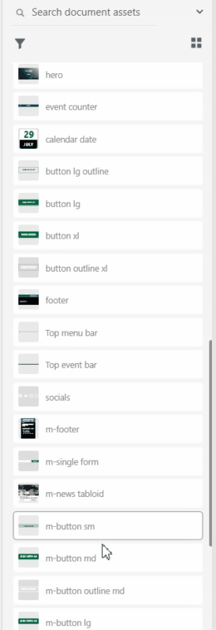
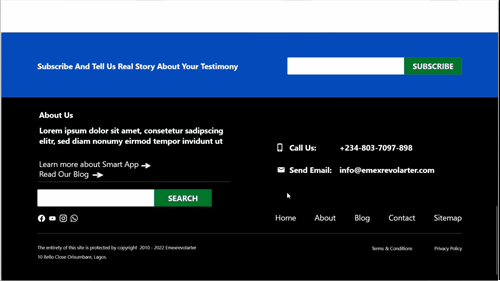

# AdobeXD UI Templates

Landing page of Web and mobile UIs for businesses, Institutions, and organizations, including sample images and texts.

The template list below will be updated as new ones are added.

## Assets
<a href="assets/videos/assets%20xd%20church%20type%201.mp4" target="_blank">View the assets example</a> for church type 1

Assets used

Mobile view

Web view

## Included Templates

### 1. Church Type 1

Sleek design for Church and religious bodies, with main focus on accessibility to notifications on news and events. The color scheme: blue and green. This design was created during one of our commissioned projects. This Project includes a minimum of 24 pages.

[Download Church type 1 XD file][1]

[View Mobile Demo][2] | [View Web Demo][3]

### 2. Church Type 2

Second variant of Church template series.

[Download Church type 2 XD file][4]

[View Mobile Demo][5] | [View Web Demo][6]

# Included Pages
This section is updated as the more additions are made in the available templates.

:calendar: - 11th July, 2022: Updated Template 1 with 3 pages: Profile, Login, & Sign Up. Duration: 4 hours.

:calendar: - 11th July, 2022: Updated Template 1 with 8 pages: Photo Gallery Categories, Photo Gallery Listing, Photo Gallery Viewer, Video Gallery Categories, Video Gallery Listing, Video Gallery Viewer, Audio Gallery Categories, & Audio Gallery Viewer. Duration: 5 hours 30 minutes. [View Media Updates][7]

Profile Page

Login Page

Sign Up Page

#### Media Updates

Photo Gallery Categories

Photo Gallery Listing

Photo Gallery Viewer

Video Gallery Categories

Video Gallery Listing

Video Gallery Viewer

Audio Gallery Categories

Audio Gallery Listener

# Creation Dates

* Church Type 1: 25th June, 2022
* Church Type 2: 25th June, 2022

Do visit our website: [https://emexrevolarter.com](https://emexrevolarter.com) for more information on web & mobile solutions.

Thank you for visiting. If you found this repository helpful, please do star it.

  [1]: templates/xd_church_type_1_home.xd
  [2]: assets/videos/xd%20church%20type%201%20_home-mobile.mp4
  [3]: assets/videos/xd%20church%20type%201%20_home-web.mp4
  [4]: templates/xd_church_type_2_home.xd
  [5]: assets/videos/xd%20church%20type%202%20_home-mobile.mp4
  [6]: assets/videos/xd%20church%20type%202%20_home-web.mp4
  [7]: #media-updates
